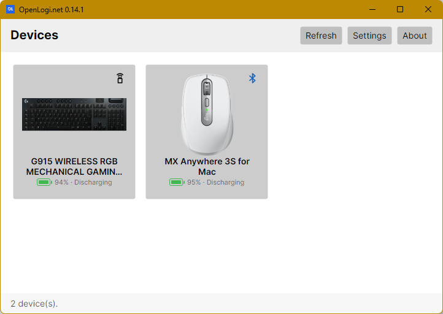

# openlogi-net

[](https://github.com/loxsmoke/openlogi-net/actions/workflows/ci.yml)
[](https://github.com/loxsmoke/openlogi-net/releases/latest)
[](https://github.com/loxsmoke/openlogi-net/releases)

📥 **[Download the latest release](https://github.com/loxsmoke/openlogi-net/releases/latest)** — installer or portable build.

**A native, local-first alternative to Logitech Options+ for Windows.** Remap
buttons, set up hold-and-swipe mouse gestures, drive DPI and SmartShift, control
RGB lighting, and switch profiles over HID++ — without a Logitech account,
telemetry, or the Options+ install.

This is a C# / .NET 10 / [Avalonia](https://avaloniaui.net/) rewrite of
[AprilNEA/OpenLogi](https://github.com/AprilNEA/OpenLogi) (originally written in
Rust), focused on Windows.

<p align="center">
    
</p>

---

## What it is

openlogi-net talks to Logitech HID++ devices — mice and keyboards — over a Logi
Bolt / Unifying / LIGHTSPEED receiver (including the Powerplay mat's embedded
receiver), or a Bluetooth-direct / wired connection, without
running Logi Options+. Everything is local: there is no account, no cloud
sync, and no telemetry.

It ships two binaries:

- **OpenLogi.App** — an Avalonia desktop app with an interactive device view,
  a per-button action picker, a gesture editor with per-direction actions and
  presets, DPI and SmartShift controls, RGB lighting (per-key colors and
  effects), per-application profiles, and a system-tray presence.
- **OpenLogi.Cli** — a headless command-line tool for device inventory,
  on-device HID++ diagnostics, asset prefetch, and lighting/profile probes.

## What it does

- **Discover devices** behind Bolt / Unifying / LIGHTSPEED receivers and direct
  Bluetooth / wired connections, with per-device online state and battery level.
- **Remap buttons** to a catalog of actions and custom keyboard shortcuts.
- **Mouse gestures** — hold a button and swipe up / down / left / right for four
  actions, with a plain tap as a fifth. Works with the dedicated MX gesture
  button *or* any capable button (Middle, Back, Forward, the wheel-mode button) —
  several at once — with Options+-style presets (Windows & Desktops, Media &
  Volume, Arrange Windows…) or fully custom per-direction actions. See
  [docs/MOUSE_GESTURES.md](docs/MOUSE_GESTURES.md).
- **DPI control** — read and set sensitivity, with presets.
- **SmartShift** — toggle the wheel ratchet mode and tune sensitivity.
- **Smooth scrolling** — divert the wheel into high-resolution HID++ reporting
  and re-inject it as fine sub-line OS scrolling (Options+-style), per device.
  Note: running Logitech software (Options+, G HUB, Logi Bolt app) alongside
  may interfere with this setting — both sides write the same volatile wheel
  mode on the device, so whichever wrote last wins.
- **RGB lighting** — solid colors, per-key colors, brightness, and built-in
  effects on supported keyboards.
- **Onboard profiles** — read, switch, and write the device's onboard
  profile sectors; per-application profile overlays in the GUI.
- **Host switching** — list and switch between paired hosts on multi-host
  devices.

> [!NOTE]
> openlogi-net is under active development and not yet stable. Features and
> configuration may still change between releases.

## How it differs from the original OpenLogi

The upstream [OpenLogi](https://github.com/AprilNEA/OpenLogi) is a Rust + GPUI
application that treats **macOS and Linux** as first-class platforms and ships
Windows only as an early, untested preview. openlogi-net flips that priority:

| | Original OpenLogi | openlogi-net |
|---|---|---|
| Language / UI | Rust + GPUI | C# / .NET 10 + Avalonia |
| Primary platform | macOS + Linux | **Windows** |
| HID++ transport | macOS/Linux HID stacks | Windows raw HID |
| Mouse gestures | One gesture button per device (MX gesture button, or OS-hook capture) | **Any capable button, several at once**, all over HID++, with gesture-set presets |
| Distribution | `.dmg`, Homebrew, `.deb`/`.rpm` | Windows installer + portable zip |

This is an independent rewrite, not a fork of the Rust code — the core logic
(device model, HID++ feature handling, brand/deep-link vocabulary) has been
ported to C#. It is **not affiliated with Logitech or with the upstream
OpenLogi project.**

## Download

Grab the latest installer or portable build from the
[**Releases page**](https://github.com/loxsmoke/openlogi-net/releases/latest).

## Install

> [!IMPORTANT]
> Quit **Logi Options+** first — the two applications fight over HID++ access,
> and only one can own a given receiver at a time. Leaving Logitech software
> running can also silently undo device-side settings this app applies (smooth
> scrolling in particular, since the wheel mode is volatile and both apps
> rewrite it).

- **Installer** — download `OpenLogi.net-<version>-setup.exe` from the latest
  release and run it. It installs to `Program Files`, adds Start-menu (and
  optional desktop) shortcuts, and registers an uninstaller.
- **Portable** — download `OpenLogi.net-<version>-win-x64-portable.zip`,
  extract it anywhere, and run `OpenLogi.App.exe`. No installation required.

Both builds are self-contained — the .NET runtime is bundled, so nothing else
needs to be installed.

## CLI usage

The CLI is a single executable; run it with a subcommand:

```
OpenLogi.Cli list      # enumerate receivers and paired devices
OpenLogi.Cli diag      # dump HID++ feature tables per device
OpenLogi.Cli hosts     # list paired hosts on multi-host devices
OpenLogi.Cli kbinfo    # keyboard brightness and RGB effect inventory
OpenLogi.Cli light <RRGGBB>   # set device lighting to a solid color
```

Run with no arguments to default to `list`. Additional diagnostic subcommands
(profile dump/copy, per-key color, effects) are available — see
[`src/OpenLogi.Cli/Program.cs`](src/OpenLogi.Cli/Program.cs).

## License

Licensed under the [MIT License](LICENSE).

**Not affiliated with Logitech.** "Logitech", "MX Master", and "Options+" are
trademarks of Logitech International S.A.

## Building

### Prerequisites

- [.NET 10 SDK](https://dotnet.microsoft.com/download) or newer
- Windows (the app and tests target `net10.0-windows`)

### Build and run

```sh
git clone https://github.com/loxsmoke/openlogi-net.git
cd openlogi-net

# build the whole solution
dotnet build OpenLogi.slnx

# run the desktop app
dotnet run --project src/OpenLogi.App

# run the CLI
dotnet run --project src/OpenLogi.Cli -- list
```

### Test

```sh
dotnet test OpenLogi.slnx
```

### Build an installable release

Releases are produced by the [`Release`](.github/workflows/release.yml)
GitHub Action (manually triggered): it fetches the next version, stamps it into
the projects, publishes a self-contained, trimmed build, and packages both an
Inno Setup installer and a portable zip. To reproduce the release build locally:

```sh
dotnet publish src/OpenLogi.App/OpenLogi.App.csproj -c Release -r win-x64 \
  --self-contained -p:PublishTrimmed=true -p:TrimMode=partial -o publish
```

The build is self-contained (the .NET runtime is bundled) and trimmed in
partial mode — only the .NET base libraries are trimmed, keeping the package
around 20 MB while leaving device I/O, config, and UI code untouched.
